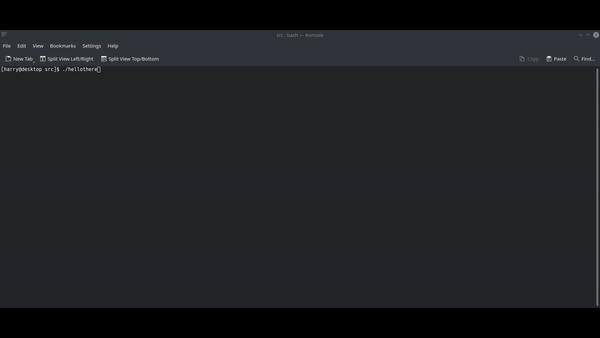

# Hello there!

C application to respond to your star wars reference in the terminal. Have your uncontrollable star wars quotes answered, simply by installing and running the ./hellothere executable, or install as an application and type hellothere to receive the following:

< img src="https://github.com/hydiar/hello-there/blob/main/hello-there.gif?raw=true" width="1000px"/ >
< img src="https://raw.githubusercontent.com/hydiar/hello-there/main/hello-there.gif" width="1000px"/ >

