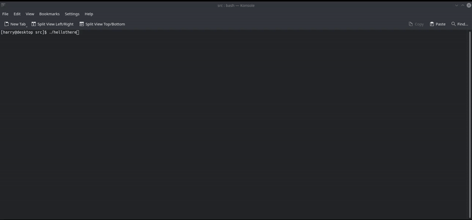

# Hello there!

C application to respond to your star wars reference in the terminal. Have your uncontrollable star wars quotes answered, simply by installing and running the ./hellothere executable, or install as an application and type hellothere to receive the following:

   

Based on the raw image frames taken from the film:

Written in C by Harry Powell.
